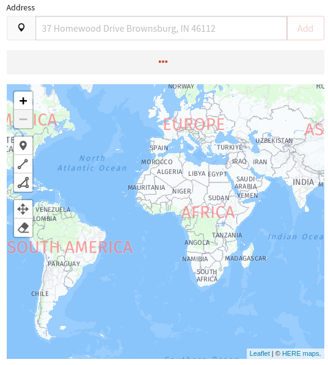

# Decidim::Locations

The gem has been developed by [Mainio Tech](https://www.mainiotech.fi/).

A [Decidim](https://github.com/decidim/decidim) module that provides the
possibility to add multiple locations to any technical records.

This is a technical module that adds this ability to Decidim but the locations
functionality needs to be manually added to the individual models, the
location input needs to be added to the editing views and the locations display
needs to be added to the record views. This module provides you all the tools to
add these elements to the user interface.

This is only the "pillar" for this functionality, you still have to install the "Locatables -module"
([Locatables](https://github.com/mainio/decidim-module-locatables)), which is a wrapper module
based on which component you want this module to be used for. Locatables contains modules for the following components:

- Proposals
- Meetings
- Survey
- Accountability

You can find more information about the functionalities from each module's README -files.

Development of this gem has been sponsored by the
[City of Helsinki](https://www.hel.fi/).

## Installation

Add this line to your application's Gemfile:

```ruby
gem "decidim-locations", github: "mainio/decidim-module-locations"
```

And then execute:

```bash
$ bundle
```

## After installation

Install migrations that add the needed tables and columns to the database:

```bash
$ bundle exec rake decidim_locations:install:migrations
$ bundle exec rake db:migrate
```

## Usage

Picking locations for records happen through an address input -field with autocomplete, which adds a marker to the map.
Alternative way is to pick one of the shapes from the map -overlay and click them to the map, which will fetch the
address using reverse geocoding.



- Picking the "Marker" adds a marker, which fetches the closest address in a 100km radius.
- Picking the "Line" adds a line, which fetches the address from the center-point of all the line's points.
- Picking the "Polygon" adds a polygon, which works the same way as the line concerning the address.

### Implementation

Add this to the model you want to attach locations to:

```ruby
class YourModel < ApplicationRecord
  include Decidim::Locations::Locatable
  # ...
end
```

Add this to the form classes in which you want to allow adding locations to the
records:

```ruby
class YourModelForm < Decidim::Form
  include Decidim::Locations::LocatableForm
end
```

Include this cell inside the record's editing form:

```erb
<%= decidim_form_for(@model_form) do |form| %>
  <% # ... other form fields ... %>
  <%== cell("decidim/locations/form", form, label: t(".locations_label")) %>
  <% # ... other form fields ... %>
<% end %>
```

And finally, inside the commands that create and update the records, include
the following:

```ruby
class YourUpdateCommand < Rectify::Command
  # Add this concern to the command
  include Decidim::Locations::LocationsCommand

  def initialize(form, model)
    @form = form
    @model = model
  end

  def call
    return broadcast(:invalid) if @form.invalid?

    # Here you would normally update the record
    @model.update!(foo: form.foo, bar: form.bar)

    # AFTER the record has been updated, call the update_locations method with
    # the model and the form objects. The form object needs to have the
    # Decidim::Locations::LocatableForm concern included as explained above.
    update_locations(@model, @form)

    broadcast(:ok, @model)
  end
end
```

If you want the locations to be also available through the GraphQL API, you will
also need to add the following to the relevant GraphQL types:

```ruby
class YourModelType < Decidim::Api::Types::BaseObject
  description "Your model"
  # ...
  implements Decidim::Locations::LocationsInterface
  # ...
end
```

After this, you will have the `locations` field available through the GraphQL
API for your models.

### Implementation example: Proposals

Visit the following link to see an example how the functionalities are implemented to the desired components.

Proposal example:

[Example](https://github.com/mainio/decidim-module-locatables/blob/main/decidim-module-proposals_locations/README.md)

## Contributing

See [Decidim](https://github.com/decidim/decidim).

### Developing

To start contributing to this project, first:

- Install the basic dependencies (such as Ruby and PostgreSQL)
- Clone this repository

Decidim's main repository also provides a Docker configuration file if you
prefer to use Docker instead of installing the dependencies locally on your
machine.

You can create the development app by running the following commands after
cloning this project:

```bash
$ bundle
$ DATABASE_USERNAME=<username> DATABASE_PASSWORD=<password> bundle exec rake development_app
```

Note that the database user has to have rights to create and drop a database in
order to create the dummy test app database.

Then to test how the module works in Decidim, start the development server:

```bash
$ cd development_app
$ DATABASE_USERNAME=<username> DATABASE_PASSWORD=<password> bundle exec rails s
```

In case you are using [rbenv](https://github.com/rbenv/rbenv) and have the
[rbenv-vars](https://github.com/rbenv/rbenv-vars) plugin installed for it, you
can add the environment variables to the root directory of the project in a file
named `.rbenv-vars`. If these are defined for the environment, you can omit
defining these in the commands shown above.

#### Code Styling

Please follow the code styling defined by the different linters that ensure we
are all talking with the same language collaborating on the same project. This
project is set to follow the same rules that Decidim itself follows.

[Rubocop](https://rubocop.readthedocs.io/) linter is used for the Ruby language.

You can run the code styling checks by running the following commands from the
console:

```
$ bundle exec rubocop
```

To ease up following the style guide, you should install the plugin to your
favorite editor, such as:

- Atom - [linter-rubocop](https://atom.io/packages/linter-rubocop)
- Sublime Text - [Sublime RuboCop](https://github.com/pderichs/sublime_rubocop)
- Visual Studio Code - [Rubocop for Visual Studio Code](https://github.com/misogi/vscode-ruby-rubocop)

### Testing

To run the tests run the following in the gem development path:

```bash
$ bundle
$ DATABASE_USERNAME=<username> DATABASE_PASSWORD=<password> bundle exec rake test_app
$ DATABASE_USERNAME=<username> DATABASE_PASSWORD=<password> bundle exec rspec
```

Note that the database user has to have rights to create and drop a database in
order to create the dummy test app database.

In case you are using [rbenv](https://github.com/rbenv/rbenv) and have the
[rbenv-vars](https://github.com/rbenv/rbenv-vars) plugin installed for it, you
can add these environment variables to the root directory of the project in a
file named `.rbenv-vars`. In this case, you can omit defining these in the
commands shown above.

### Test code coverage

If you want to generate the code coverage report for the tests, you can use
the `SIMPLECOV=1` environment variable in the rspec command as follows:

```bash
$ SIMPLECOV=1 bundle exec rspec
```

This will generate a folder named `coverage` in the project root which contains
the code coverage report.

### Localization

If you would like to see this module in your own language, you can help with its
translation at Crowdin:

https://crowdin.com/project/decidim-access-requests

## License

See [LICENSE-AGPLv3.txt](LICENSE-AGPLv3.txt).
